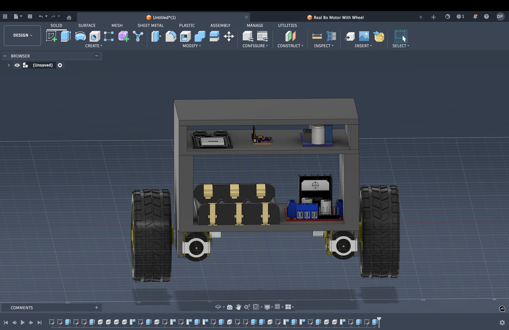

# Self-Balancing Robot

This is a simple self-balancing robot built using ESP32.

the robot tries to stay upright on two wheels.  
It keeps checking its tilt and adjusts the motors to prevent falling.

---

## How it works

- The MPU6050 sensor measures the tilt of the robot  
- The ESP32 continuously reads this data  
- A PID controller calculates how much correction is needed  
- The motors move forward or backward to maintain balance  

All of this runs in a fast loop, so the robot keeps correcting itself in real time.

---

## Components used

- ESP32 
- MPU6050 (gyroscope + accelerometer)  
- Motor driver (L298N or similar)  
- 2 DC motors  
- Battery  

---

## Features

- real-time angle tracking  
- PID-based balancing  
- smooth motor control  
- basic filtering for improved stability  

---

## Why I made it?

- it is something i want to make because i think balencing a bot on two wheels is somewhat challenging and i never did this project before so i want to do it.

---

## Photos

#This image is the cad which ib made by my own to simulate that how my project will look like once it will be completed. I also build it so that i can get the estimate size of base structure so that i can place all components on there place easily.
--

# I created this circuit diagram in this format to visualize how the final project will look and function as a complete system. It also helps me estimate the base structure size and organize component placement efficiently before actual implementation.
---

---

#I wrote the code in this structured format to clearly simulate and control how the complete system will function once the project is implemented. It also helps in organizing logic, debugging easily, and ensuring all components interact properly before real-world deployment.

---

## Components List 

| Component                     | Quantity     | Min Price (INR) | Purchase Link |
|-----------------------------|-------------|-----------------|--------------|
| Arduino Uno/Nano            | 1           | 250             | [Buy](https://robu.in/product/arduino-nano-v3-0-clone/) |
| MPU6050 Sensor              | 1           | 120             | [Buy](https://robu.in/product/mpu6050-module/) |
| DC Gear Motors              | 2           | 150             | [Buy](https://www.amazon.in/dp/B07H7L5J4X) |
| Motor Driver (L298N/L293D)  | 1           | 120             | [Buy](https://robu.in/product/l298n-motor-driver-module/) |
| Wheels                      | 2           | 100             | [Buy](https://www.amazon.in/dp/B07H9LZV9F) |
| Chassis/Frame               | 1           | 250             | [Buy](https://www.amazon.in/dp/B08L5VQK9P) |
| Battery (Li-ion/LiPo)       | 1           | 200             | [Buy](https://robu.in/product/18650-li-ion-battery/) |
| Voltage Regulator           | 1           | 50              | [Buy](https://robu.in/product/lm2596-step-down-module/) |
| Jumper Wires                | As needed   | 80              | [Buy](https://www.amazon.in/dp/B01EV70C78) |
| Breadboard/PCB              | 1           | 100             | [Buy](https://www.amazon.in/dp/B01EV6LJ7G) |
| Switch                      | 1           | 20              | [Buy](https://robu.in/product/toggle-switch/) |

**Estimated Total Cost:** ~₹1,440
---

